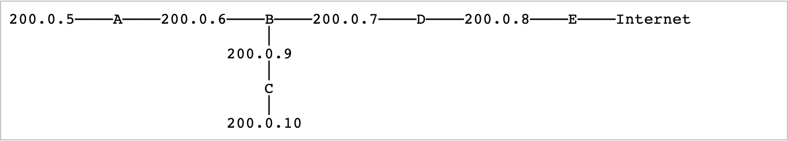

# CS 4375 - Operating Systems

## Homework 4

* Dordal’s Introduction to Computer Networks, Chapter 7, questions 4, 6, 6.5

### Author: Matthew S Montoya

## Chapter 7, Question 4

**The following diagram has routers A, B, C, D and E; E is the “border router” connecting the site to the Internet. All router-to-router connections are via Ethernet-LAN /24 subnets with addresses of the form 200.0.x. Give forwarding tables for each of A♢, B, C and D. Each table should include each of the listed subnets and also a _default_ entry that routes traffic toward router E. Directly connected subnets may be listed with a next_hop of “direct”.**

Forwarding Table **A**: 

| Destination    | Next_Hop      |
| :-------------:|:-------------:|
| 200.0.5.0/24   | Direct        |
| 200.0.6.0/24   | Direct        |
| 200.0.7.0/24   | B             |
| 200.0.8.0/24   | B             |
| 200.0.9.0/24   | B             |
| 200.0.10.0/24  | B             |
| Default        | B             |

 

Forwarding Table **B**: 

| Destination    | Next_Hop      |
| :-------------:|:-------------:|
| 200.0.5.0/24   | A             |
| 200.0.6.0/24   | Direct        |
| 200.0.7.0/24   | Direct        |
| 200.0.8.0/24   | D             |
| 200.0.9.0/24   | Direct        |
| 200.0.10.0/24  | C             |
| Default        | D             |

 

Forwarding Table **C**: 

| Destination    | Next_Hop      |
| :-------------:|:-------------:|
| 200.0.5.0/24   | B             |
| 200.0.6.0/24   | B             |
| 200.0.7.0/24   | B             |
| 200.0.8.0/24   | B             |
| 200.0.9.0/24   | Direct        |
| 200.0.10.0/24  | Direct        |
| Default        | B             |

 

Forwarding Table **D**: 

| Destination    | Next_Hop      |
| :-------------:|:-------------:|
| 200.0.5.0/24   | B             |
| 200.0.6.0/24   | B             |
| 200.0.7.0/24   | Direct        |
| 200.0.8.0/24   | Direct        |
| 200.0.9.0/24   | B             |
| 200.0.10.0/24  | B             |
| Default        | E             |

 

Forwarding Table **E**: 

| Destination    | Next_Hop      |
| :-------------:|:-------------:|
| 200.0.5.0/24   | D             |
| 200.0.6.0/24   | D             |
| 200.0.7.0/24   | D             |
| 200.0.8.0/24   | Direct        |
| 200.0.9.0/24   | D             |
| 200.0.10.0/24  | D             |
| Default        | E             |

## Chapter 7, Question 6

**For each IPv4 network prefix given (with length), identify which of the subsequent IPv4 addresses are part of the same subnet.**

**A. 10.0.130.0/23: 10.0.130.23, 10.0.129.1, 10.0.131.12, 10.0.132.7 **

Because IPv4 addresses are 32 bits long (4 bytes) and the prefix is **/23**, we compare the first 7 bits of the third byte. 
If the first seven bits of the third byte in each adress match, the IP address is a part of the same subnet.  
Expressed in binary, the third byte (130) is **1000 001**0. Note: The network portion is in **bold**.

* 10.0.129.1
  * 129: **1000 000**1. This address is **NOT** in the same subnet.
* 10.0.130.23
  * 130: **1000 001**0. This address is in the same subnet.
* 10.0.131.12
  * 131: **1000 001**1. This address is in the same subnet.
* 10.0.132.7
  * 132: **1000 010**0. This address is **NOT** in the same subnet.

**B. 10.0.132.0/22: 10.0.130.23, 10.0.135.1, 10.0.134.12, 10.0.136.7 **

Because IPv4 addresses are 32 bits long (4 bytes) and the prefix is **/22**, we compare the first 6 bits of the third byte. 
If the first six bits of the third byte in each adress match, the IP address is a part of the same subnet.  
Expressed in binary, the third byte (132) is **1000 01**00. Note: The network portion is in **bold**.

* 10.0.130.23
  * 130: **1000 00**10. This address is **NOT** in the same subnet.
* 10.0.134.1
  * 134: **1000 01**10. This address is in the same subnet.
* 10.0.135.1
  * 135: **1000 01**11. This address is in the same subnet.
* 10.0.136.7
  * 136: **1000 10**00. This address is **NOT** in the same subnet.

**C. 10.0.64.0/18: 10.0.65.13, 10.0.32.4, 10.0.127.3, 10.0.128.4 **

Because IPv4 addresses are 32 bits long (4 bytes) and the prefix is **/18**, we compare the first 2 bits of the third byte. 
If the first two bits of the third byte in each adress match, the IP address is a part of the same subnet.  
Expressed in binary, the third byte (64) is **01**00 0000. Note: The network portion is in **bold**.

* 10.0.32.4
  * 32: **00**10 0010. This address is **NOT** in the same subnet.
* 10.0.65.13
  * 65: **01**00 0001. This address is in the same subnet.
* 10.0.127.3
  * 127: **01**11 1111. This address is in the same subnet.
* 10.0.128.4
  * 128: **10**00 0000. This address is **NOT** in the same subnet.

**D. ♢ 10.0.168.0/21: 10.0.166.1, 10.0.170.3, 10.0.174.5, 10.0.177.7 **

Because IPv4 addresses are 32 bits long (4 bytes) and the prefix is **/21**, we compare the first 5 bits of the third byte. 
If the first five bits of the third byte in each adress match, the IP address is a part of the same subnet.  
Expressed in binary, the third byte (168) is **1010 1**000.  Note: The network portion is in **bold**.

* 10.0.166.1
  * 166: **1010 0**110. This address is **NOT** in the same subnet.
* 10.0.170.3
  * 170: **1010 1**010. This address is in the same subnet.
* 10.0.174.5
  * 174: **1010 1**110. This address is in the same subnet.
* 10.0.177.7
  * 177: **1011 0**001. This address is **NOT** in the same subnet.

**E. 10.0.0.64/26: 10.0.0.125, 10.0.0.66, 10.0.0.130, 10.0.0.62 **

Because IPv4 addresses are 32 bits long (4 bytes) and the prefix is **/26**, we compare the first 2 bits of the fourth byte. 
If the first two bits of the fourth byte in each adress match, the IP address is a part of the same subnet.  
Expressed in binary, the fourth byte (64) is **01**00 0000.  Note: The network portion is in **bold**.

* 10.0.0.62
  * 128: **10**00 0000. This address is **NOT** in the same subnet.
* 10.0.0.66
  * 66: **01**00 0010. This address is in the same subnet.
* 10.0.0.125
  * 125: **01**11 1101. This address is in the same subnet.
* 10.0.0.130
  * 130: **10**00 0010. This address is **NOT** in the same subnet.

## Chapter 7, Question 6.5

**Convert the following subnet masks to /k notation, and vice-versa:**

**A. ♢ 255.255.240.0 **
Each byte in the address is 8 bits (1111 1111) long. **240 is 1111 0000**. 
255.255.240.0 is **11111111 11111111 1111**0000 00000000, making this **/20**. 

**B. 255.255.248.0 **
Each byte in the address is 8 bits (1111 1111) long. **248 is 1111 1000**. 
255.255.240.0 is **11111111 11111111 11111**000 00000000, making this **/21**. 

**C. 255.255.255.192 **
Each byte in the address is 8 bits (1111 1111) long. **192 is 1111 0000**. 
255.255.240.0 is **11111111 11111111 11111111 11**000000, making this **/26**. 

**D. ♢ /20 **
Each byte in the address is 8 bits (1111 1111) long. /20 is 11111111 11111111 11110000 00000000 
**/20 is 255.255.240.0.** 

**E. /22 **
Each byte in the address is 8 bits (1111 1111) long. /22 is 11111111 11111111 11111100 00000000 
**/20 is 255.255.252.0.** 

**F. /27**
Each byte in the address is 8 bits (1111 1111) long. /27 is 11111111 11111111 11111111 11100000 
**/27 is 255.255.255.224.** 
